# Linux, dressed as macOS

A free Lubuntu laptop that looks and feels a lot like my MacBook: menu bar with Wi-Fi, Bluetooth, Sound,
Battery and notification menus, Notification Center, Dock, Launchpad, Spotlight, Finder, traffic-light
buttons, and a macOS-style login and lock screen.

**[Every change, explained →](docs/CHANGES.md)**: what was changed, where, and why.
Website: **[rajiv2312.github.io/lubuntu-macos](https://rajiv2312.github.io/lubuntu-macos/)**.
This project continues [linux-macos-look](https://github.com/rajiv2312/linux-macos-look) (the first version, 28 September 2026).

I didn't edit a single config file myself. I described what I wanted to an AI coding agent
([Claude Code](https://claude.com/claude-code)), one request at a time, and it did the work, starting with
a full backup and a one-command undo.


| Menu bar | Spotlight |
|---|---|
|  |  |
| **Launchpad** | **Finder** |
|  |  |
| **Terminal** | **Dock** |
|  |  |

### Menu-bar menus and Notification Center

Click an icon in the menu bar and a small panel drops down instead of an app opening, like on a Mac.
Clicking the clock opens a Notification Center with Calendar and World Clock widgets.

| Wi-Fi | Bluetooth | Sound |
|---|---|---|
| 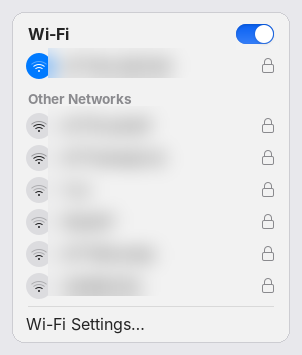 | 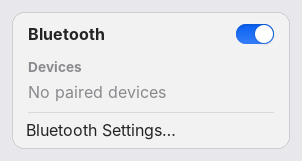 | 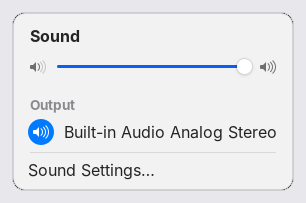 |
| **Battery** | **Notifications** | **Notification Center** |
| 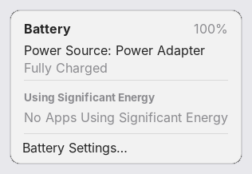 | 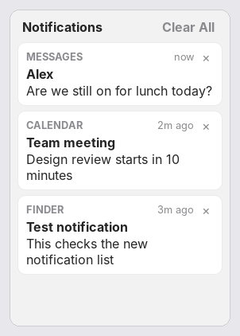 | 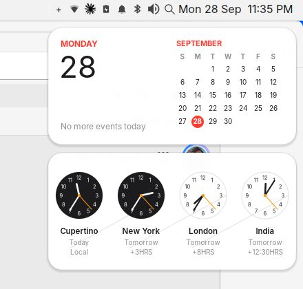 |

(Wi-Fi network names are blurred.)

### Finder list view and the lock screen

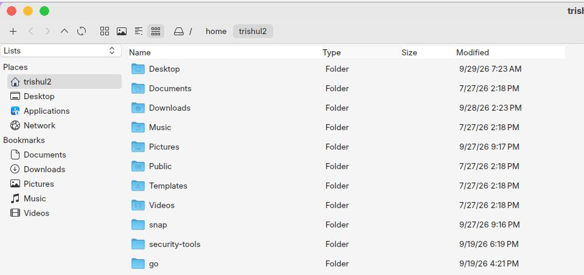

The login screen is also the lock screen (closing the lid, `Ctrl+Alt+L`, Apple menu → Lock Screen):

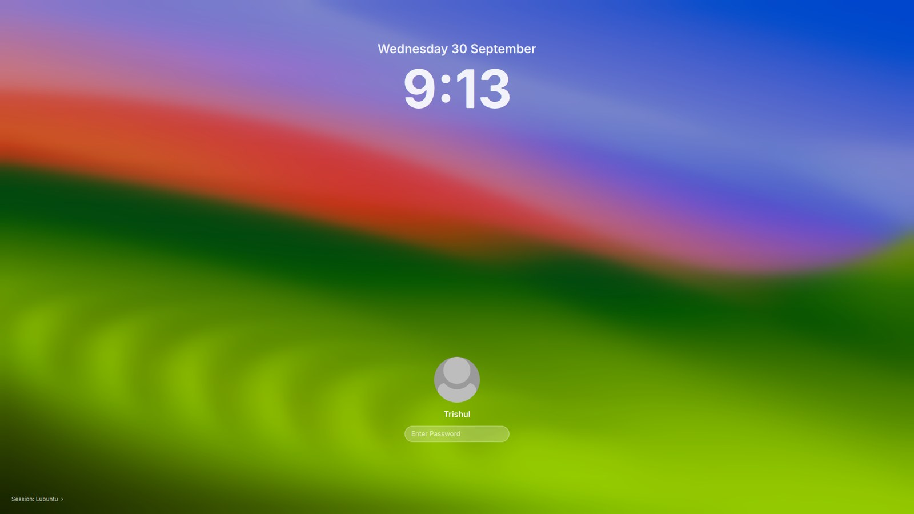

### Before and after

Clean "before" shots of stock Lubuntu weren't captured before the first change, so these compare
individual features just before and after they were changed:

| Finder | Lock screen |
|---|---|
| 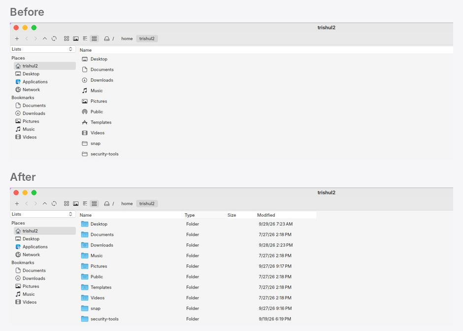 | 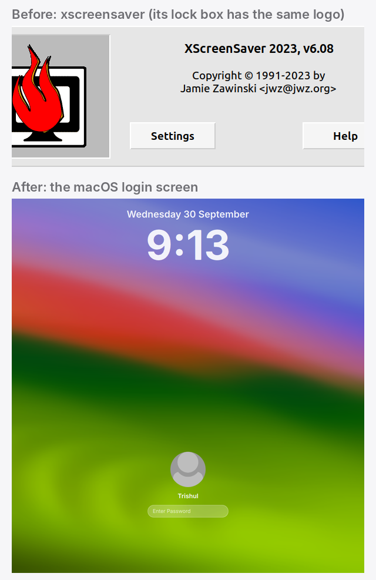 |
| **Menu titles** (macOS spacing) | **Terminal title bar** (same height as other windows) |
| 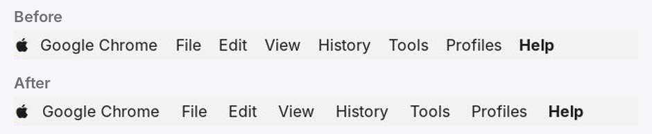 | 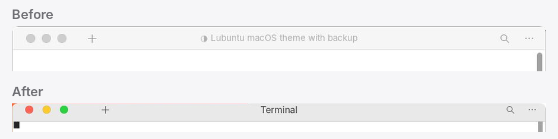 |

To see stock Lubuntu for comparison, install Lubuntu 26.04 in a virtual machine and take a screenshot before running the installer.

## Try it

> **Back up and try it in a virtual machine first.** This was built on one machine and has not been
> tested anywhere else. Both installers back up everything they change and print a `restore.sh` that undoes it.

### Lubuntu 26.04 (the full version, as in the screenshots)

```bash
git clone https://github.com/rajiv2312/lubuntu-macos.git
cd lubuntu-macos/lubuntu
./install.sh
```

Log out and back in when it's done.

| macOS | Here |
|---|---|
| Launchpad | `F4`, or the rocket in the Dock |
| Spotlight | `Super + Space`, or the magnifier in the menu bar |
| Apple menu | the Apple logo (Sleep, Restart, Shut Down, Log Out, ...) |
| Finder | the file manager (PCManFM-Qt) |
| Notification Center | click the clock |
| Lock Screen | `Ctrl+Alt+L`, Apple menu, or close the lid |

**Undo:** `~/macos-look-backup/<date>/restore.sh`, then log out and back in.
Single features can be removed with `~/.local/share/macos-theme/undo-status-menus`, `undo-macos-lock` and `undo-animations`.

### Ubuntu 26.04 with GNOME (experimental)

```bash
cd lubuntu-macos/gnome
./install.sh
```

GNOME works differently from LXQt, so this version gets the same look using GNOME's own parts:
WhiteSur GTK + Shell theme, Ubuntu Dock moved to the bottom, traffic lights on the left, Big Sur wallpaper.
Launchpad is GNOME's app grid and Spotlight is GNOME search (press `Super`).
**Untested so far.** Please open an issue if something breaks.

## What the Lubuntu installer changes

A short summary; **[docs/CHANGES.md](docs/CHANGES.md)** lists every file and setting.

- **Themes:** WhiteSur GTK (light + dark), WhiteSur icons (+ colour folders in Finder's list view), WhiteSur Kvantum for
  Qt apps (made opaque, bigger tabs, Finder-style column dividers), McMojave cursors with macOS resize arrows,
  Inter font at 12 pt everywhere. Downloaded from GitHub at pinned versions.
- **Menu bar:** LXQt panel + vala-panel global menu with an Apple menu, macOS-sized titles and spacing; light bar,
  monochrome icons, no hover tooltips, Spotlight icon.
- **Menu-bar menus:** Wi-Fi, Bluetooth, Sound, Battery and a notification list open macOS-style drop-down panels.
- **Notification Center:** click the clock for Calendar and World Clock widgets.
- **Dock:** Plank with magnification, running dots and Trash; Finder, Launchpad, Terminal, Preview (and Chrome, Claude,
  Photo Booth if installed) pinned.
- **Launchpad & Spotlight:** rofi, themed as a full-screen app grid and a centred search bar.
- **Windows:** Openbox themes with red/yellow/green buttons on the left, 32 px title bars, rounded corners, animations,
  invisible resize margins, inactive-window look, drag a maximised window out by its title bar.
- **Finder:** list view by default (Name, Type, Size, Modified; resizable columns), Favorites-style sidebar, macOS wording in dialogs.
- **Apps renamed like macOS:** Finder, Terminal (GNOME Terminal), Preview, TextEdit, Photo Booth.
- **Login and lock screen:** a small SDDM theme with blurred wallpaper, big clock, round avatar and pill password
  field; locking shows the same screen (safely, see CHANGES.md).
- **Wallpapers & screensaver:** WhiteSur's Big Sur, Monterey, Ventura and Sonoma wallpapers; Ken Burns slideshow
  screensaver, Flurry as the alternative.
- **Extras:** light notification cards (top right), macOS-style password prompt.

Everything under `lubuntu/files/` is copied into your home folder (`@HOME@` / `@REALNAME@` are filled in for you).
The author's own preferences (Finder sort order, dock pins, world clocks, wallpaper) are included and marked in CHANGES.md.

## Credits

- [WhiteSur GTK](https://github.com/vinceliuice/WhiteSur-gtk-theme), [WhiteSur icons](https://github.com/vinceliuice/WhiteSur-icon-theme),
  [WhiteSur KDE/Kvantum + wallpapers](https://github.com/vinceliuice/WhiteSur-kde) and
  [McMojave cursors](https://github.com/vinceliuice/McMojave-cursors) and [WhiteSur wallpapers](https://github.com/vinceliuice/WhiteSur-wallpapers) by vinceliuice. They are downloaded by the installer, not included here.
- [Plank](https://launchpad.net/plank), [rofi](https://github.com/davatorium/rofi), [vala-panel-appmenu](https://gitlab.com/vala-panel-project/vala-panel-appmenu),
  [Inter](https://rsms.me/inter/), [Papirus](https://github.com/PapirusDevelopmentTeam/papirus-icon-theme), LXQt, Openbox, picom.
- Built with [Claude Code](https://claude.com/claude-code).

Not affiliated with or endorsed by Apple. macOS, Finder, Launchpad and Spotlight are trademarks of Apple Inc.,
used here only to describe the look.

## License

The scripts and configs in this repository are MIT licensed (see `LICENSE`), except:
- `lubuntu/files/home/.local/share/lxqt/themes/kvantum-macos/` is a modified copy of LXQt's *kvantum* panel theme (LGPL-2.1+).
- `lubuntu/files/home/.local/share/plank/themes/WhiteSur-Dark/dock.theme` is based on WhiteSur's Plank theme (MIT).

Downloaded third-party themes keep their own licenses.
